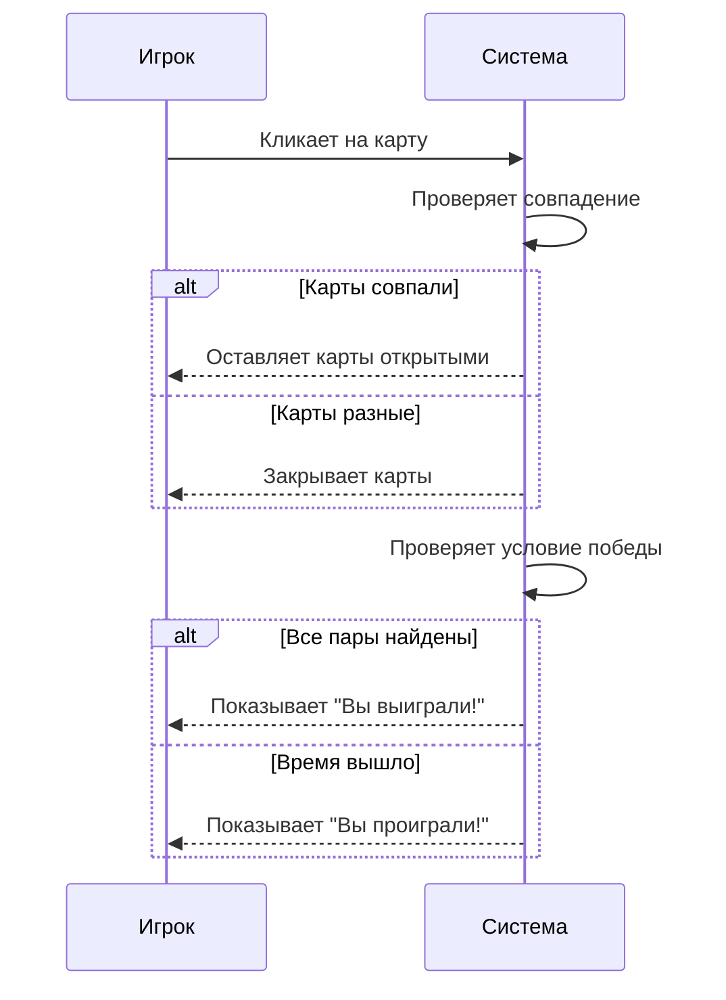

Memory Card Game - Phaser 3 Implementation


Описание игры
Memory Card Game - это классическая игра на запоминание карт, реализованная с использованием фреймворка Phaser 3. Игрок должен находить пары одинаковых карт за ограниченное время. Проект включает анимации, таймер,  интерактивный интерфейс.

Особенности
🎮 Полноценная игровая механика нахождения пар карт

⏱️ Таймер обратного отсчета

🏆 Система определения победы/поражения

✨ Плавные анимации:

Вылет карт при старте игры

Анимация переворота карт

Вылет карт при завершении игры

🖥️ Адаптивный интерфейс

🔄 Возможность перезапуска игры

Технологии
Phaser 3 - игровой фреймворк

JavaScript

HTML5 Canvas

Установка и запуск
Клонируйте репозиторий:

```bash
git clone https://github.com/sega211/memory.git
```

Установите зависимости:

настройте live-server для разработки:

```bash
npm install -g live-server
```
Запустите игру:

```bash
npm live-server
```
Игра будет доступна по адресу: http://localhost:8080

Структура файлов
```
memory
├── assets
│   ├── images
│   │   ├── bg.jpg          - фоновое изображение
│   │   ├── card_back.png   - рубашка карты
│   │   ├── card1.png       - карта 1
│   │   └── ...             - другие карты
│   ├── sounds  
│   │   ├── open.wav        - звук открытия карты
│   │   ├── win.wav         - звук победы
│   │   └── ...             - другие звуки
│   └── styles
│       └── style.css      - стили игры
├── srcipts
│   ├── GameScene.js        - основной класс игры
│   ├── Card.js             - класс карты
│   └── main.js             - конфигурация игры
├── index.html              - главная страница
```
Конфигурация игры
В файле scripts/main.js можно настроить параметры игры:


```javascript
export const config = {
    rows: 4,            // Количество строк
    cols: 4,            // Количество столбцов
    cards: [1, 2, 3, 4, 5], // Доступные карты
    timeout: 60         // Время игры в секундах
};
```

Геймплей
Игра начинается с анимации вылета карт из верхнего левого угла

Игрок открывает карты, кликая на них

При открытии двух одинаковых карт они остаются открытыми

Если карты разные - они автоматически закрываются

Игрок должен найти все пары до истечения времени

При победе или поражении появляется соответствующее сообщение

Нажатие "Играть снова" перезапускает игру

Автор
[Mnogodeto4ka]
Сайт
[www.mnogodeto4ka.ru]
Email
[sega21@mail.ru]